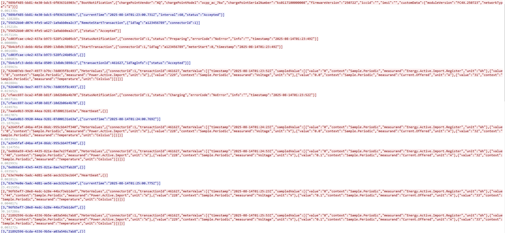
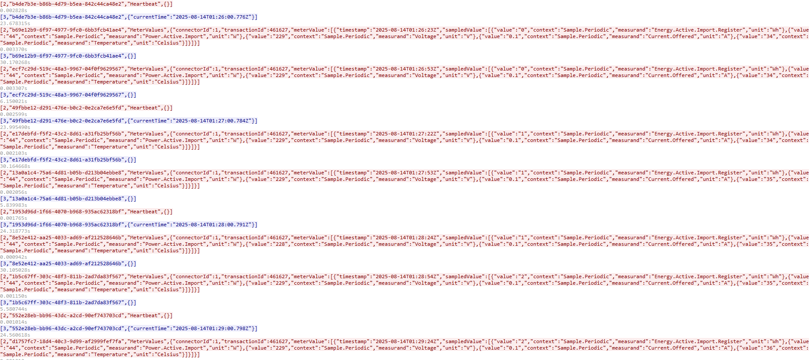
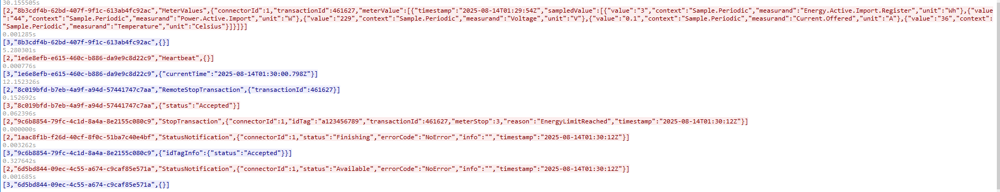

# OCPP-charge-Server

[中文](README_zh.md)

A **Java + Spring Boot** based **OCPP 1.6J WebSocket server**, supporting communication between EV charging stations and a platform.
Basic functionality has been tested: start command delivery, stop command delivery, status upload (normal), BootNotification and device information parsing work correctly.

Suitable for:

* Charging station manufacturers testing OCPP protocol integration
* Platform R\&D debugging OCPP 1.6J business logic
* Learning WebSocket and OCPP protocol implementation

---

## ✨ Features

* Supports **OCPP 1.6J** protocol (WebSocket JSON)
* Supported message types:

  * BootNotification (device startup report)
  * Heartbeat
  * Authorize (card authentication)
  * StartTransaction / StopTransaction (start/stop charging)
  * MeterValues (meter data)
  * SendLocalList (send local authorization list)
  * GetLocalListVersion (query local list version)
  * TriggerMessage (trigger station to report actively)
  * GetConfiguration (retrieve configuration parameters)
* **Device information parsing**: automatically parses vendor, model, serial number, firmware version, SIM info, etc. from BootNotification messages
* In-memory session management: maintains charging station status, last communication time, and device information
* REST API for querying station status
* Logging and debug output

---

## 📦 Requirements

* **Java** jdk1.8
* **Maven** 3.6+
* Recommended memory ≥ 512MB
* Network: able to access the charging station’s WebSocket connection

---

## 🚀 Quick Start

### 1. Clone the project

```bash
git clone https://github.com/qyhua0/ocpp_charge.git
cd ocpp
```

### 2. Build and package

```bash
mvn clean package -DskipTests
```

### 3. Start the service

```bash
java -jar target/ocpp-server-1.0.0.jar
```

Default listening port: `8080`
OCPP WebSocket address:

```
ws://<server-ip>:8080/ocpp/{chargePointId}
```

---

## 🔌 Example: BootNotification Parsing

Station report:

```json
[2,"uuid","BootNotification",{
  "chargePointVendor":"XQ",
  "chargePointModel":"ocpp_ac_7kw",
  "chargePointSerialNumber":"ks0117100000008",
  "firmwareVersion":"250722",
  "iccid":"",
  "imsi":"",
  "customData":{
    "moduleVersion":"FC4X.250723",
    "networkType":"1"
  }
}]
```

Example charging flow:

- Startup information
  
- Charging station energy upload information
  
- Charging end information
  

- For detailed messages, please refer to[202508144_交互报文(开机，充电开始，充电结束).txt](doc/202508144_交互报文(开机，充电开始，充电结束).txt)

---

## 📡 REST API

(For testing convenience, all REST APIs are set to GET so they can be called directly in a browser)

| Method | Path                                                                  | Description                                                                            |
| ------ | --------------------------------------------------------------------- | -------------------------------------------------------------------------------------- |
| GET    | /api/ocpp/connections                                                 | Show current station connection details                                                |
| GET    | /api/ocpp/status/{cpId}                                               | Get the status and device info of a specific station                                   |
| GET    | /api/ocpp/remoteStart/{cpId}?idTag={idTag}\&connectorId={connectorId} | Issue start charging command (`idTag` required, `connectorId` optional)                |
| GET    | /api/ocpp/remoteStop/{cpId}?transactionId={transactionId}             | Issue stop charging command                                                            |
| GET    | /api/ocpp/localList/version/{cpId}?timeoutSeconds={seconds}           | Query station-side LocalList version (optional timeout in seconds, default 10)         |
| GET    | /api/ocpp/localList/full/{cpId}?timeoutSeconds={seconds}              | Send full whitelist (Full overwrite)                                                   |
| POST   | /api/ocpp/localList/diff/{cpId}?timeoutSeconds={seconds}              | Send incremental whitelist (Differential), request body is `SendLocalListRequest` JSON |

---

## 🛠 Development Guide

### Project Structure

```
src/main/java
 ├── top.modelx
 │    ├── ws      # WebSocket Server implementation
 │    ├── service # OCPP message handling
 │    ├── model   # Device information, session objects
 │    ├── api     # REST controllers
 │    └── util    # Message construction utilities
```

### Adding a New OCPP Action

1. Add a `case` branch in `OcppService.handleCall`
2. Parse the payload and execute the business logic
3. Use `OcppMessageUtil.buildCallResult` to return the response

---

## 🧪 Testing

Verified:

* BootNotification send/receive works, device status can be queried via REST
* Authorize, RemoteStart, RemoteStop transaction loop works correctly
* SendLocalList and GetLocalListVersion can be sent and parsed
* Heartbeat and WebSocket ping/pong maintain the connection

---

## 📄 License

This project is open-sourced under the [MIT License](LICENSE).

---

## 📬 Contact

For questions or suggestions, please submit a [GitHub Issue](https://github.com/quhua0/ocpp_charge/issues) or email [admin@modelx.top](mailto:admin@modelx.top)
