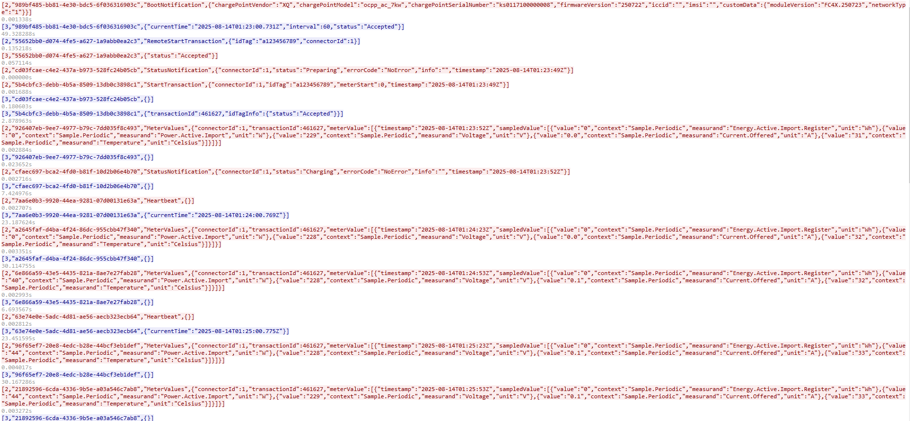
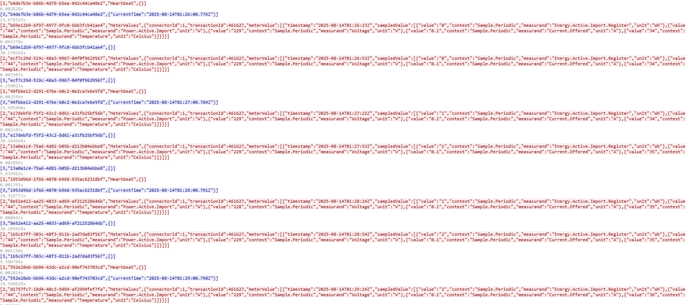
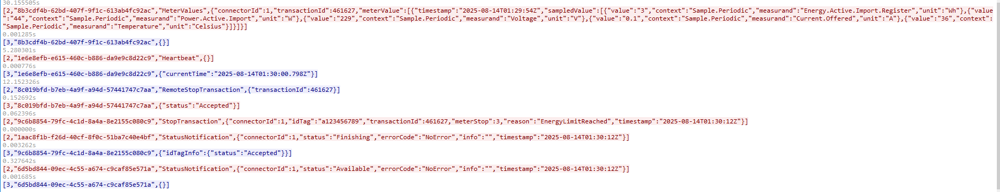

# OCPP-charge-Server

一个基于 **Java + Spring Boot** 开发的 **OCPP 1.6J WebSocket 服务器**，支持电动车充电桩与平台的通信。  
已通过基础功能测试：下发启动、下发停止、状态上传、正常，BootNotification 与设备信息解析正常。  

适合：
- 充电桩厂商测试 OCPP 协议接入
- 平台研发调试 OCPP 1.6J 业务逻辑
- 学习 WebSocket 与 OCPP 协议实现

---

## ✨ 功能特性

- 支持 **OCPP 1.6J** 协议（WebSocket JSON）
- 支持的消息类型：
  - BootNotification（设备启动上报）
  - Heartbeat（心跳）
  - Authorize（卡号认证）
  - StartTransaction / StopTransaction（启动、停止充电）
  - MeterValues（电表数据）
  - SendLocalList（下发本地授权名单）
  - GetLocalListVersion（查询本地名单版本）
  - TriggerMessage（触发桩主动上报）
  - GetConfiguration（获取配置参数）
- **设备信息解析**：自动解析 BootNotification 报文中的厂商、型号、序列号、固件版本、SIM 信息等
- 内存会话管理：维护充电桩状态、最后通讯时间、设备信息
- REST API 查询桩状态
- 日志记录与调试信息输出

---

## 📦 环境要求

- **Java** jdk1.8
- **Maven** 3.6+
- 推荐内存 ≥ 512MB
- 网络：可访问充电桩的 WebSocket 连接

---

## 🚀 快速开始

### 1. 克隆项目
```bash
git clone https://github.com/qyhua0/ocpp_charge.git
cd ocpp
````

### 2. 编译打包

```bash
mvn clean package -DskipTests
```

### 3. 启动服务

```bash
java -jar target/ocpp-server-1.0.0.jar
```

默认监听端口：`8080`
OCPP WebSocket 地址：

```
ws://<server-ip>:8080/ocpp/{chargePointId}
```

---

## 🖥 新增 Web 管理界面（可视化操作与设备日志查看）

项目现已新增简洁的 Web 管理页面，便于用户进行充电控制与设备通信日志的实时查看。  
原项目无前端界面，所有操作依赖 REST API 调用；现通过浏览器即可完成远程启停充电、监控连接状态、查看完整交互报文。

主要功能：
- 实时显示已接入的充电桩
- 一键远程启动/停止充电
- 查看充电设备的通信交互日志（含完整 OCPP 报文）

使用方式：启动服务后，访问
```
http://<server-ip>:8080/web
```
即可进入 Web 界面。

如图所示：
- Web 界面概览  
  
- 远程启动充电操作，查看设备通信交互日志。 
  

> ⚠️ 注意：Web 界面仅用于测试与调试，生产环境建议配合权限认证与 HTTPS 加密。

---

## 🔌 示例：BootNotification 解析

桩上报：

```json
[2,"uuid","BootNotification",{
  "chargePointVendor":"XQ",
  "chargePointModel":"ocpp_ac_7kw",
  "chargePointSerialNumber":"ks0117100000008",
  "firmwareVersion":"250722",
  "iccid":"",
  "imsi":"",
  "customData":{
    "moduleVersion":"FC4X.250723",
    "networkType":"1"
  }
}]
```
如充电示例如图：
 - 开机启动信息

 - 充电桩电量上传信息

 - 结束充电信息
 
 
- 详细报文请查看[202508144_交互报文(开机，充电开始，充电结束).txt](doc/202508144_交互报文(开机，充电开始，充电结束).txt)
---

## 📡 REST API
（为了方便测试，REST API全改成get方式，在浏览器直接调用即可）

| 方法   | 路径 | 说明 |
| ------ | ---- | ---- |
| GET    | /api/ocpp/connections | 显示当前的桩连接资料 |
| GET    | /api/ocpp/status/{cpId} | 获取指定桩的状态与设备信息 |
| GET    | /api/ocpp/remoteStart/{cpId}?idTag={idTag}\&connectorId={connectorId} | 下发启动充电（`idTag` 必填，`connectorId` 可选） |
| GET    | /api/ocpp/remoteStop/{cpId}?transactionId={transactionId} | 下发结束充电 |
| GET    | /api/ocpp/localList/version/{cpId}?timeoutSeconds={seconds} | 查询桩端 LocalList 版本（可选超时秒数，默认 10） |
| GET    | /api/ocpp/localList/full/{cpId}?timeoutSeconds={seconds} | 全量下发白名单（Full 覆盖） |
| POST   | /api/ocpp/localList/diff/{cpId}?timeoutSeconds={seconds} | 增量下发白名单（Differential），请求体为 `SendLocalListRequest` JSON |
---

## 🛠 开发指南

### 项目结构

```
src/main/java
 ├── top.modelx
 │    ├── ws      # WebSocket Server 实现
 │    ├── service # OCPP 消息处理
 │    ├── model   # 设备信息、会话对象
 │    ├── api     # REST 控制器
 │    └── util    # 消息构建工具
```

### 新增 OCPP 动作

1. 在 `OcppService.handleCall` 中添加 case 分支
2. 解析 payload，执行业务逻辑
3. 使用 `OcppMessageUtil.buildCallResult` 返回应答

---

## 🧪 测试说明

已验证：

* BootNotification 收发正常，设备状态可在 REST 查询
* Authorize、RemoteStart、RemoteStop 交易闭环正常
* SendLocalList、GetLocalListVersion 可下发并解析
* 心跳与 WebSocket ping/pong 保持连接

---

## 📄 许可证

本项目采用 [MIT License](LICENSE) 开源。

---

## 📬 联系

如有问题或建议，请提交 [GitHub Issues](https://github.com/quhua0/ocpp_charge/issues) 或发送邮件至 [admin@modelx.top](mailto:admin@modelx.top)

